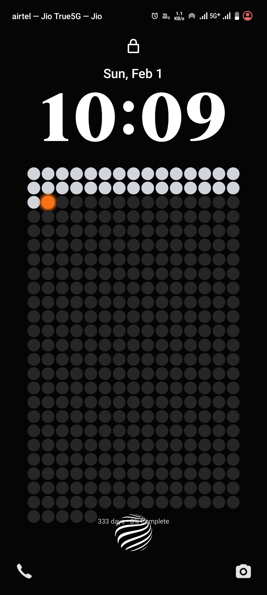
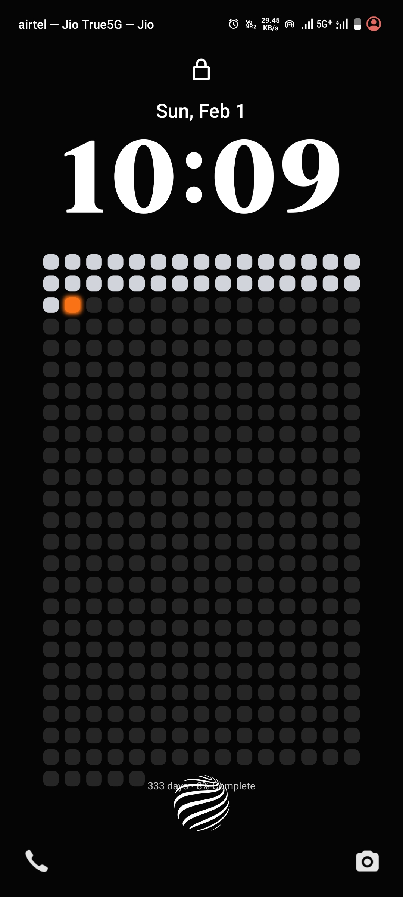
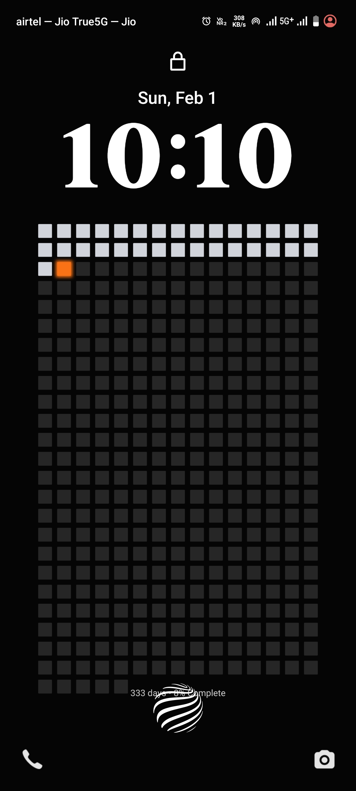
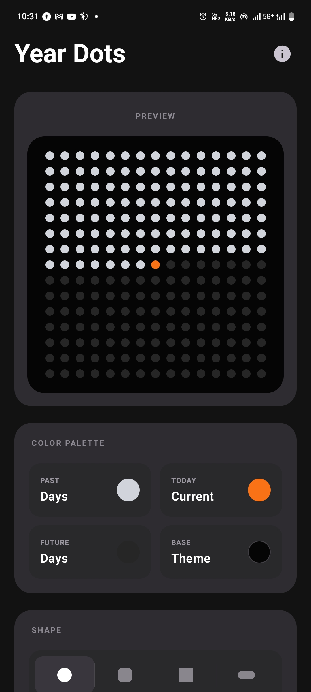
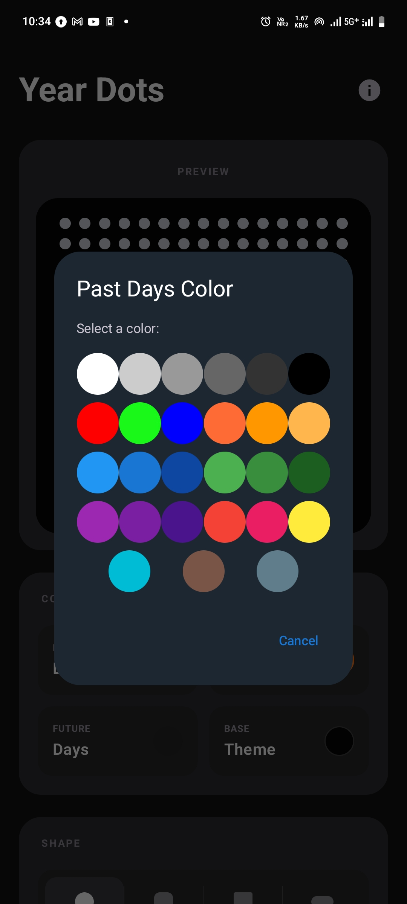
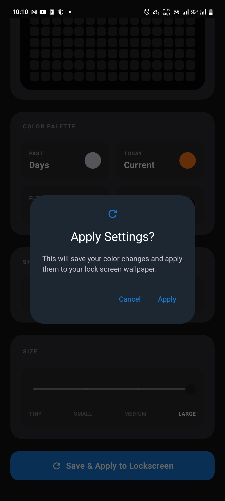
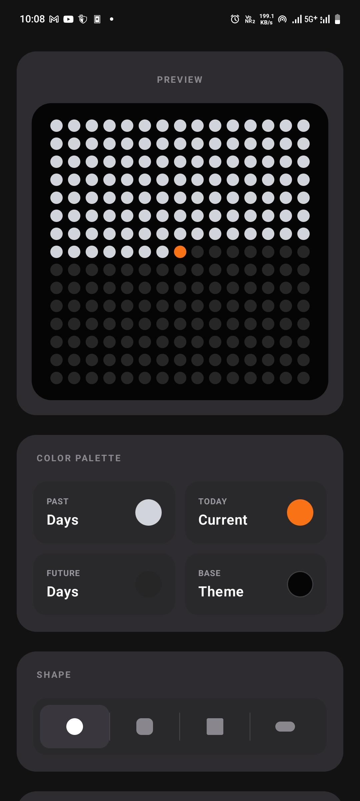
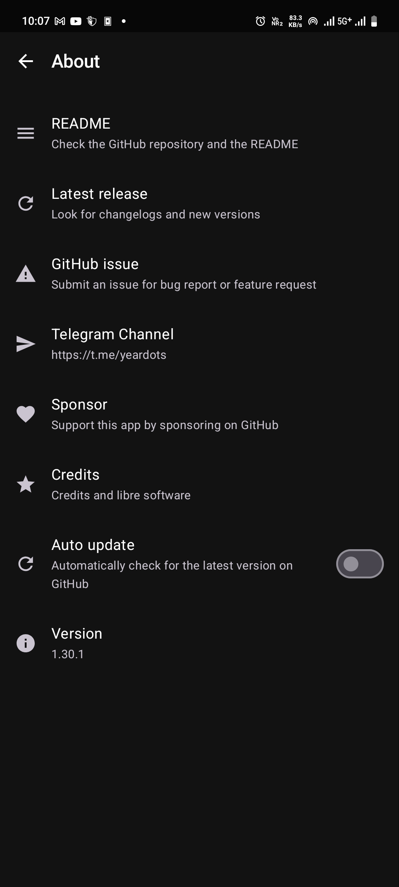
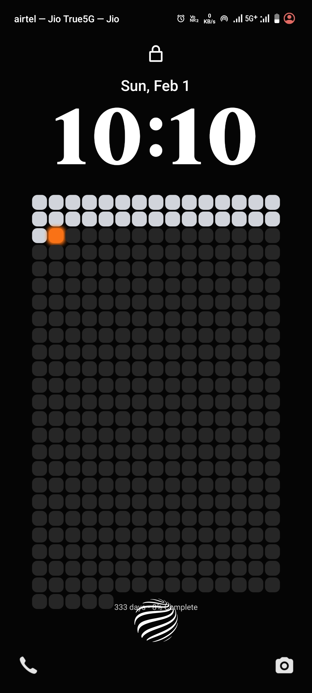
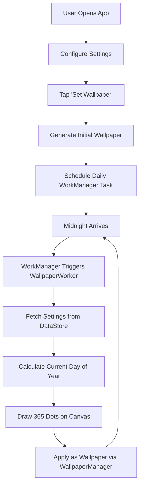

# Year Dots - Your Year in 365 Dots

<p align="center">
  
</p>

<p align="center">
  <strong>A minimalist Android wallpaper that visualizes your year's progress, one day at a time</strong>
</p>

<p align="center">
  
  
  
  
  
</p>

---

## 📖 About

**Year Dots** transforms your phone's wallpaper into a daily reminder of time's passage. Each day of the year is represented by a single dot in a 365-dot grid that updates automatically at midnight.

> *"Time is passing. Make it count."* ⏳

Inspired by life calendar visualizations and the philosophy that awareness of time's finite nature helps us live more intentionally.

---

## ✨ Features

### Core Functionality
- 🗓️ **365-Dot Calendar Grid** - Visual representation of the entire year
- 🔄 **Automatic Daily Updates** - Wallpaper refreshes at midnight using WorkManager
- 🎨 **Fully Customizable Colors** - Choose colors for past, present, future, and background
- 🔲 **Four Dot Shapes** - Circle, Rounded Square, Square, and Pill
- 📏 **Four Size Options** - Tiny, Small, Medium, and Large dot densities
- 👁️ **Live Preview** - See changes in real-time before applying

### Privacy & Performance
- 🔒 **100% Offline** - No internet permission, no tracking, zero ads
- 🔋 **Battery Efficient** - Optimized background tasks with minimal battery impact
- 🌙 **AMOLED-Friendly** - Dark backgrounds conserve battery on modern displays
- 🚫 **No Data Collection** - Your privacy is guaranteed

---

## 📱 Screenshots

<p align="center">
  
  
  
  
  
  
  
  
  
</p>

---

## 📥 Installation

### Option 1: Download APK (Recommended)
1. Go to [Releases](https://github.com/ikrishanaa/Year-Dots/releases)
2. Download the latest `YearDots-v*.apk`
3. Install on your Android device (you may need to enable "Install from Unknown Sources")

### Option 2: F-Droid (Coming Soon)
Year Dots will be available on F-Droid repository soon. See our [Publishing Guide](PUBLISHING.md) for details on F-Droid submission.

### Option 3: Build from Source
```bash
git clone https://github.com/ikrishanaa/Year-Dots.git
cd year-dots
./gradlew assembleDebug

```

---

## 🚀 Quick Start

1. **Install the app** using one of the methods above
2. **Open Year Dots** and configure your preferred colors
3. **Tap "Set Wallpaper"** to apply
4. That's it! Your wallpaper will auto-update daily at midnight

### Customization Options
- **Colors**: Customize past days, today, future days, and background
- **Shapes**: Choose from Dot, Rounded, Square, or Pill
- **Size**: Select Tiny, Small, Medium, or Large density
- **Preview**: See all changes in real-time before applying

---

## 🛠️ Technical Stack

| Component | Technology |
|-----------|-----------|
| **Language** | Kotlin |
| **UI Framework** | Jetpack Compose (Material 3) |
| **Background Tasks** | WorkManager |
| **Data Persistence** | DataStore (Preferences) |
| **Graphics Engine** | Android Canvas API |
| **Architecture** | MVVM-inspired, Repository pattern |

### Key Dependencies
- `androidx.work:work-runtime-ktx` - Daily wallpaper updates
- `androidx.datastore:datastore-preferences` - Settings storage
- `androidx.compose.material3:material3` - Modern UI components

---

## 📁 Project Structure

```
app/
├── core/
│   └── WallpaperGenerator.kt      # Canvas rendering logic
├── data/
│   └── SettingsRepository.kt      # DataStore wrapper
├── worker/
│   └── WallpaperWorker.kt         # Background update worker
├── util/
│   └── WorkScheduler.kt           # Task scheduling
├── receiver/
│   └── BootReceiver.kt            # Reschedule after reboot
├── ui/
│   ├── components/                # Reusable Compose components
│   └── theme/                     # Material 3 theme
└── MainActivity.kt                # Main UI and ViewModel logic
```

---

## 🎯 How It Works



### Wallpaper Generation Algorithm
1. Calculate current day of year (1-365/366)
2. Create bitmap sized to screen dimensions
3. Calculate 20-column grid layout
4. For each of 365 positions:
   - Determine color (past/today/future)
   - Apply selected shape (circle, rounded, square, pill)
   - Draw with specified size density
5. Apply subtle glow effect for visual depth
6. Set as system wallpaper

---

## 🤝 Contributing

Contributions are welcome! Please read [CONTRIBUTING.md](CONTRIBUTING.md) for details on:
- Reporting bugs
- Suggesting features
- Submitting pull requests
- Code style guidelines

---

## 🐛 Found a Bug?

Please check [existing issues](https://github.com/ikrishanaa/Year-Dots/issues) first. If your bug hasn't been reported:
1. Open a [new issue](https://github.com/ikrishanaa/Year-Dots/issues/new/choose)
2. Use the bug report template
3. Include your Android version and device model
4. Attach screenshots if possible

---

## 📋 Roadmap

### v1.1 (Planned)
- [ ] Widget support for home screen
- [ ] Export wallpaper as image
- [ ] Multiple calendar systems (lunar, ISO week-based)
- [ ] Animations on wallpaper change

### v1.2 (Planned)
- [ ] Milestone markers for important dates
- [ ] Weekly/monthly view modes
- [ ] Tile/pattern backgrounds

See [open issues](https://github.com/ikrishanaa/Year-Dots/issues) for feature discussions.

---

## 📜 License

This project is licensed under the **MIT License** - see the [LICENSE](LICENSE) file for details.

**TL;DR:** You can freely use, modify, and distribute this code. Attribution appreciated but not required.

---

## 🙏 Acknowledgments

**Inspiration:**
- [4,000 Weeks: Time Management for Mortals](https://www.oliverburkeman.com/books) by Oliver Burkeman
- Memento mori tradition
- Life calendar visualizations ([WeeklyDots](https://play.google.com/store/apps/details?id=com.weeklydots), [One Dot](https://play.google.com/store/apps/details?id=com.onedot.lifetracker))
- [Wait But Why's Life Calendar](https://waitbutwhy.com/2014/05/life-weeks.html)

**Special Thanks:**
- The Jetpack Compose community
- F-Droid for championing open-source Android apps
- Everyone who values intentional living

---

## 👨‍💻 Author

**Krishana**  
*Year Dots v1.0 - January 2026*

- 🐛 Report bugs: [GitHub Issues](https://github.com/ikrishanaa/Year-Dots/issues)
- 💡 Suggest features: [Feature Requests](https://github.com/ikrishanaa/Year-Dots/issues/new/choose)
- 📧 Email: krishanaindia773@gmail.com
- 💬 Telegram: [t.me/yeardots](https://t.me/yeardots)

---

## 📊 Stats

<p align="center">
  
  
  
</p>

---

<p align="center">
  <sub>Made with ❤️ and ⏰ awareness</sub>
</p>

<p align="center">
  <i>"The trouble is, you think you have time." - Buddha</i>
</p>
